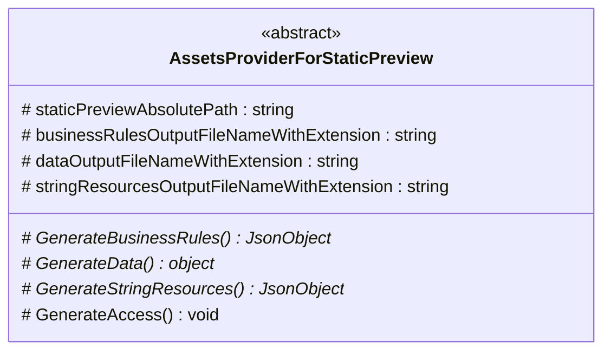

The [npm package](https://www.npmjs.com/package/@yamato-daiwa/pug-csharp-static-preview) and related 
  [nuget package](https://www.nuget.org/packages/YamatoDaiwa.PugCSharpStaticPreview) for the creating of the Pug 
  [static preview](https://github.com/TokugawaTakeshi/Yamato-Daiwa-Frontend/blob/master/CoreLibrary/Package/Documentation/PagesTemplates/StaticPreviewAnywherePage/StaticPreviewAnywherePage.md#the-concept-of-static-preview) 
  in C# hybrid and web applications.
More exactly, this stack provides the solution for the following tasks:

* Generating of the entities (enterprise business rules) objects based on C# classes which could be injected to Pug
* Generating of the string resources based on C# classes which could be injected to Pug
* Generating of the mock data based on C# classes which could be injected to Pug

The [Yamato Daiwa Automation](https://automation.yamato-daiwa.com/) project building tool will also required
  to complete this tasks.


## Installation
### npm package

```shell
npm i @yamato-daiwa/pug-csharp-static-preview -D -E
```

### nuget package

```shell
npm i dotnet add package YamatoDaiwa.PugCSharpStaticPreview --version 0.1.0
```


## Functionality
### C#
#### `AssetsProviderForStaticPreview` Class

